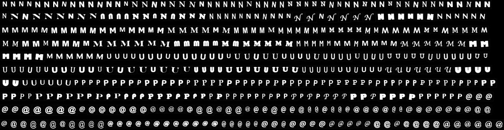

# IIC3724 - Pattern recognition

Just an unordered repository for the exercises and assignments of the course IIC3724 Pattern Recognition, taught by Domingo Mery, Universidad Católica de Chile.
The files will be sorted into folders when the course ends.

	
	 

